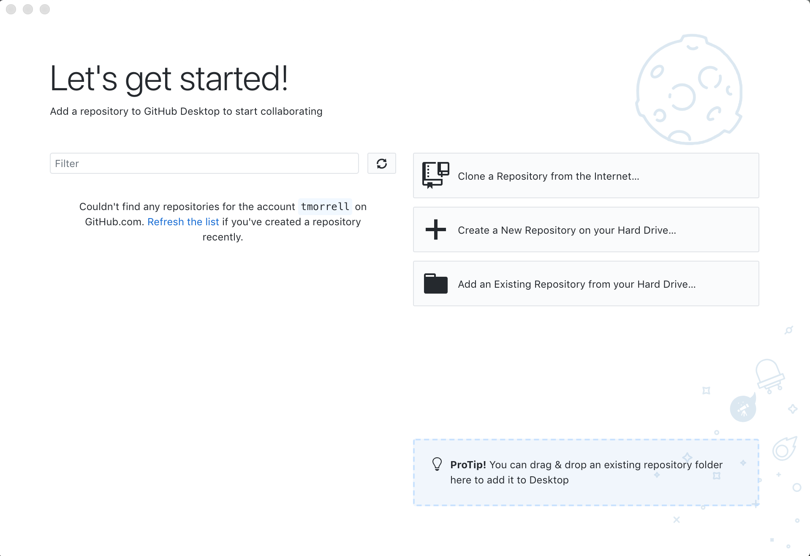

Once Git is configured, we can start using it.

Let's create a new repository for our work. A Git **repository** is
a data structure used to track changes to a set of project files over time.
Repositories are stored within the same directory as these project files,
in a hidden directory called `.git`, which we don’t need to be concerned with right now.
Click "Create new repository".  

> ## CLI Steps
> https://swcarpentry.github.io/git-novice/03-create/
>
> First, we will create a new directory for our project and enter that directory.
> <!explain commands as we go along>
> 
> ~~~
> $ mkdir hello-world
> $ cd hello-world
> ~~~
> {: .bash}
> 
> We will now create an empty git repository to track changes to our project. To do this we will use the git **init** command, 
> which is simply short for *initialise*.
> 
> ~~~
> $ git init
> ~~~
> {: .bash}
> ~~~
> Initialized empty Git repository in <your file path>/hello-world/.git/
> ~~~
> {: .output}
> 
> The `hello-world` directory is now a git repository.  
{: .solution}

Then we give our repository a name - in this case `hello-world`.  
We also choose the location to put the repository on our local computer.  For this workshop it's easier to
put the repository on your desktop.  It's also good practice to check the README box, which will create a blank
file where we can put information about our content.  We'll discuss Git ignore (which handles files
you don't want tracked) later in the workshop, and the License section is a discussion for another workshop.  

If you look on your desktop you'll see a new folder.  This is your new repository, which is just like any other
folder on your computer.  However, it is also special because Git can now track versions of your files.

You'll now see that GitHub Desktop shows the status of your repository.  You haven't added anything yet,
so no changes show up.

> ## Advanced tip
> If you navigate to the `hello-world` directory on the command line
> and use `ls -a` flag to show everything,
> we can see that Git has created a hidden directory within `hello-world` called `.git`:
> 
> ~~~
> $ ls -a
> ~~~
> {: .bash}
> 
> ~~~
> .	..	.git
> ~~~
> {: .output}
>
> Git stores information about the project in this special sub-directory.
> If we ever delete it,
> we will lose the project's history.
>
{: .callout}

> ## Places to Create Git Repositories
>
> Try to create a new git repository inside of the `hello-world` repository you just created.
> Since you don't have the welcome screen any more, you'll need to go to File/New Repository.
>
> What happens?  Can you create the sub-repository? Why is it a bad idea to do this? 
>
> > ## Solution
> >
> > Git repositories can interfere with each other if they are "nested" in the
> > directory of another: the outer repository will try to version-control 
> > the inner repository. Therefore, it's best to create each new Git
> > repository in a separate directory. GitHub Desktop is smart enough to block this operation,
> > even if the repository wasn't created in GitHub Desktop (that's the suggestion in the yellow triangle-
> > we've already added the repo so it doesn't do anything).
> {: .solution}
{: .challenge}
