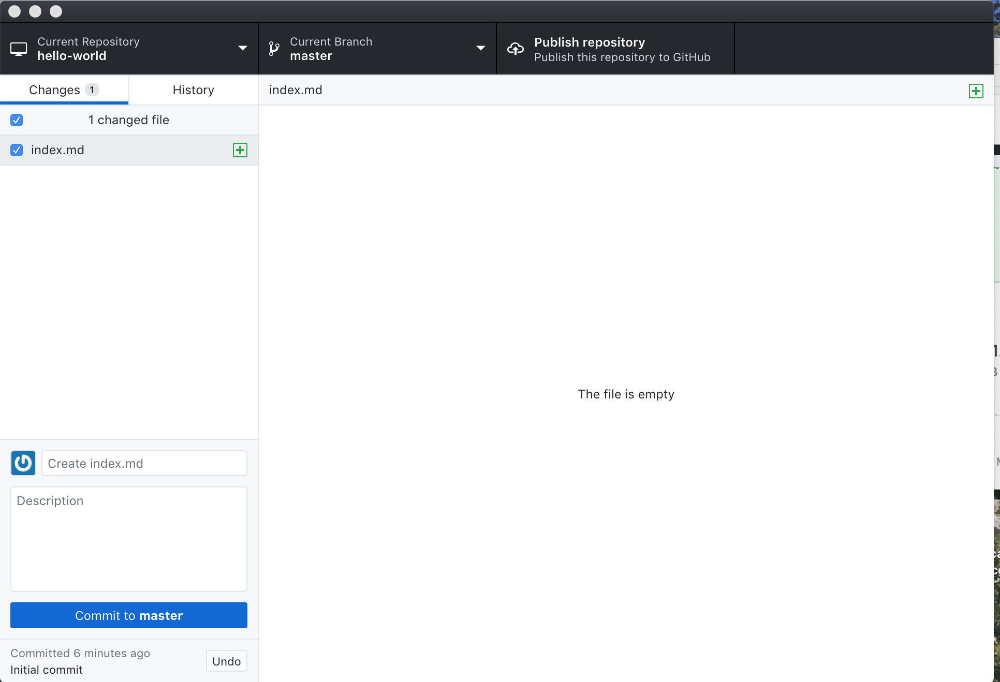
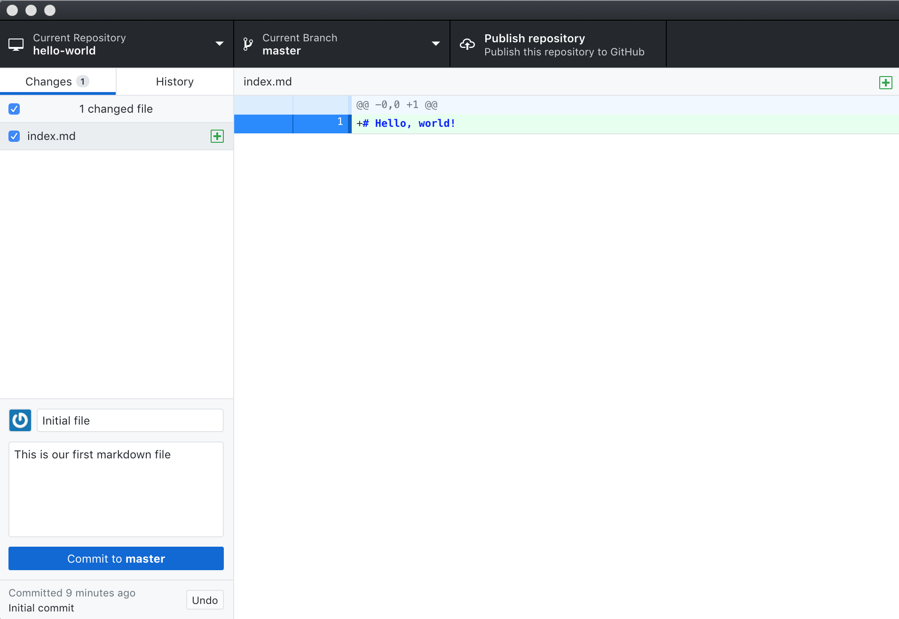
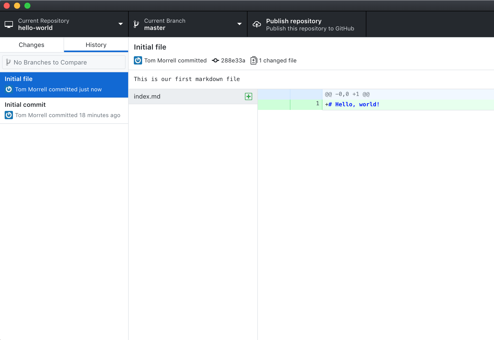
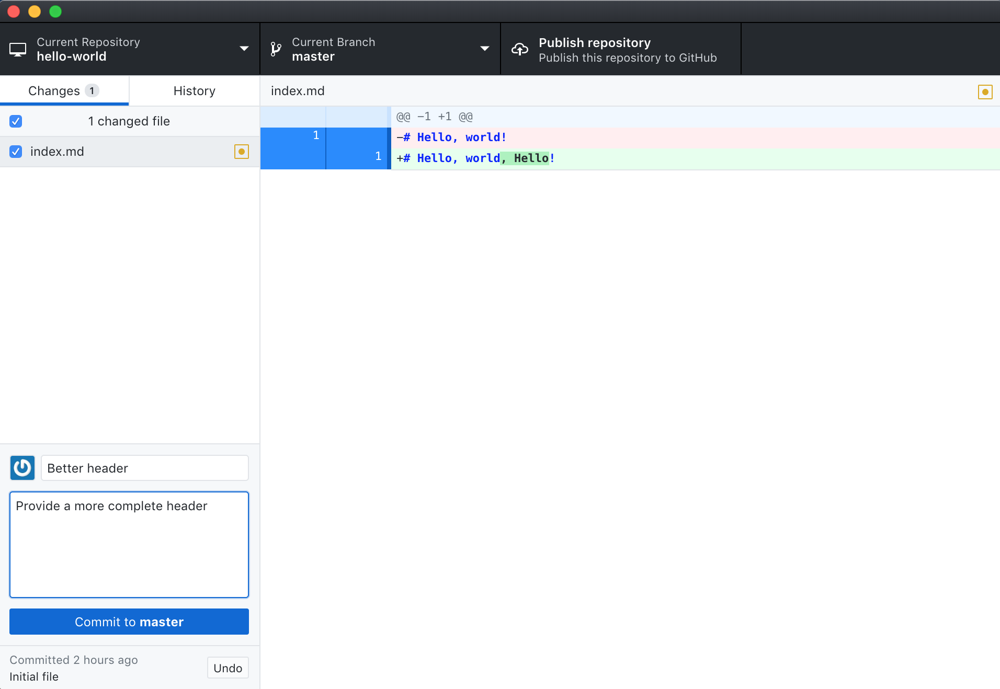

You should now have a `hello-world` repository on your desktop.

Let’s create a file and add it to the repository.

> ## CLI Steps
> [https://swcarpentry.github.io/git-novice/04-changes/](https://swcarpentry.github.io/git-novice/04-changes/)
>
> This is a two-stage process. First, we **add** any files for which
> we want to save the changes to a staging area,
> then we **commit** those changes to the repository.
> This two-stage process gives us fine-grained control over what should
> and should not be included in a particular commit.
>
> Let's create a new file using the `touch` command, which is a quick way to create an empty file.
> 
> ~~~
> $ touch index.md
> ~~~
> {: .bash}
> 
> The `.md` extension above signifies that we have chosen to use the Markdown format,
> a lightweight markup language with plain text formatting syntax.
> We will explore Markdown a bit later.
> 
> Let's check the status of our project.
> 
> ~~~
> $ git status
> ~~~
> {: .bash}
> ~~~
> On branch master
> No commits yet
> Untracked files:
>   (use "git add <file>..." to include in what will be committed)
> 
>     index.md
> 
> nothing added to commit but untracked files present (use "git add" to track)
> ~~~
> {: .output}
> 
> This status is telling us that git has noticed a new file in our directory that
> we are not yet tracking.
> With colorised output, the filename will appear in red.
> To change this, and to tell Git we want to track any changes we make to index.md, we use `git add`.
> 
> ~~~
> $ git add index.md
> ~~~
> {: .bash}
> 
> This adds our Markdown file to the **staging area** (the area where git checks for file changes).
> To confirm this we want to use `git status` again.
> 
> ~~~
> $ git status
> ~~~
> {: .bash}
> ~~~
> On branch master
> 
> No commits yet
> 
> Changes to be committed:
>   (use "git rm --cached <file>..." to unstage)
> 
>     new file:   index.md
> ~~~
> {: .output}
> 
> If we are using colorised output, we will see that the filename has changed color
> (from red to green). Git also tells us that there is a new file to be committed,
> but, before we do that, let's add some text to the file.
> 
> We will edit the file `index.md` with the nano text editor on the command line.
> 
> ~~~
> $ nano index.md
> ~~~
> {: .bash}
> 
> Type `# Hello, world!` into the file. Then press Control-O to save
> and then Control-X to exit nano.
> 
> Now, let’s check if Git has spotted the changes.
> 
> ~~~
> $ git status
> ~~~
> {: .bash}
> ~~~
> On branch master
> 
> No commits yet
> 
> Changes to be committed:
>  (use "git rm --cached <file>..." to unstage)
> 
>  new file:   index.md
> 
> Changes not staged for commit:
>  (use "git add <file>..." to update what will be committed)
>  (use "git checkout -- <file>..." to discard changes in working directory)
> 
>  modified:   index.md
> ~~~
> {: .output}
> 
> This lets us know that git has indeed spotted the changes to our file,
> but that it hasn't yet staged them,
> so let's add the new version of the file to the staging area.
> 
> ~~~
> $ git add index.md
> ~~~
> {: .bash}
{: .solution}

Open a plain text editor (typically Notepad on Windows or TextEdit on macOS) and save an empty file named `index.md` in the `hello-world` directory.

You'll see that GitHub Desktop has changed to signify that a new file has been added. The left hand panel, which shows changes that have occurred in the repository, lists the new file.  It knows this is a new file that it will have to add to the repository, as indicated by the green plus sign.

Edit the file again and add the text `# Hello, world!` on the first line. Save the file and then check that contents of the file appear in green in the right hand panel of Git Desktop, showing the lines that have changed.

To finalize saving this version of the file in the repository we need to write a commit message that describes our changes and commit the changes.

> ## CLI Steps
> Now we are ready to  **commit** our first changes.
> Commit is similar to 'saving' a file to Git.
> However, compared to saving, a commit provides a lot more information about the changes we have made,
> and this information will remain visible to us later.
> 
> ~~~
> $ git commit -m 'Add index.md'
> ~~~
> {: .bash}
> ~~~
> [master (root-commit) e9e8fd3] Add index.md
>  1 file changed, 1 insertion(+)
>  create mode 100644 index.md
> ~~~
> {: .output}
> 
> We can see that one file has changed and that we made one insertion,
> which was a line with the text '# Hello, world!'.
> We can also see the commit message 'Add index.md',
> which we added by using the `-m` flag after `git commit`.
> The commit message is used to record a short, descriptive, and specific summary
> of what we did to help us remember later on without having to look at the actual changes.
> If we just run `git commit` without the `-m` option, Git will launch nano
> (or whatever other editor we configured as `core.editor`)
> so that we can write a longer message.
> 
> Having made a commit, we now have a permanent record of what was changed,
> along with metadata about who made the commit and at what time.
{: .solution}

You can provide both a short summary of the changes and a longer description by typing in the lower left hand corner of GitHub Desktop. Then click Commit to master.

When we commit our changes,
Git takes everything we have told it to save 
and stores a copy permanently inside the special `.git` directory.
This permanent copy is called a [commit]({{ page.root }}/reference/#commit)
(or [revision]({{ page.root }}/reference/#revision)) and is assigned a identifier.  

If you click the History tab you'll see a record of the changes you have made.  The "Initial commit' was generated automatically when you requested a README file to be added to the repository, and at the top you'll see the commit we made with the summary "Initial file".  More details are listed on the right hand side, including the description and a short version identifier for the commit (7118513 in the example - yours will be different). 

> ## Where Are My Changes?
> If we look in our directory at this point, we will still see just one file called `survey_data_cleaned.csv`.
> That's because Git saves information about files' history
> in the special `.git` directory mentioned earlier
> so that our filesystem doesn't become cluttered
> (and so that we can't accidentally edit or delete an old version).
{: .callout}

Now let's open up our data file in a spreadsheet program.  In reality you'll want to make most changes to data files using code (we'll talk about this tomorrow), but for now we're going to manually make changes to see how things work.  Some of the fields in the data file don't have weights.  Let's add a some text in the first note field that the scale was broken.  Save the file (Because you're working with a csv file Excel may complain.  Make sure that your data file is still saved as a csv).

When we switch back to GitHub Desktop, we see that something has happened in Changes tab.  Our data file appears in the left hand panel with a yellow star, which signifies that this file has been changed.  In the right hand panel we can see that one line in our .csv file, shown in green, has been added (it includes the "scale broken" note).  It also shows that the line without the note has been removed, shown in red.  If we write a commit message these changes will be saved in our history.

When we look at the history tab, we can see our new commit in the list.  It's got a completely different identifier.  Note that git only saves the history of changes, as opposed to multiple copies of files.  This is why git works well for text files and code, but not so well for images and binary files.

> ## Directories
>
> Two important facts you should know about directories in Git.
>
> 1. Git does not track directories on their own, only files within them.
> Try adding a folder to survey_data.
> 
> Note, our newly created empty directory `directory` does not appear in
> the changes tab of GitHub Desktop. This is the reason why you will sometimes see `.gitkeep` files
> in otherwise empty directories. Unlike `.gitignore`, these files are not special
> and their sole purpose is to populate a directory so that Git adds it to
> the repository. In fact, you can name such files anything you like.
>
>
{: .callout}

> ## Choosing a Commit Message
>
> In this moment you have the opportunity to communicate with the future ;-)
> The commit messages does need to repeat the obvious like "add", "remove",
> "change", and what exactly it was.
> 
> What would you say to a colleague who is looking over your shoulder to
> explain what you did? Come up with other commit messages that _explain_ why!
>
> > ## Solution
> > For example:
> > - "Explain missing data"
> > - "Avoid overlooking missing data in calculations"
> {: .solution}
{: .challenge}

> ## Version-controlling images
>
> All Git tools are optimised for text files and show changes line-by-line.
> GitHub Desktop and a few others can additionally show changes in image files
> like `.jpg`, `.png`, etc. Let's try it with the two screenshot in this episode!
>
> 1. Right-click the 1st screenshot (`new file`)
> 2. Download/save it into your repository folder, and commit it.
> 3. How do you now need to treat the 2nd screenshot (`commit`) to make GitHub
>    Desktop compare it to the former?
>
> > ## Solution
> > You'll want to save the 2nd image in your repository folder with the same name 
> > as the 1st.  This will overwrite the 1st image in your file system, but once 
> > you commit the 2nd image you have both images available in the git history.
> {: .solution}
{: .challenge}

[commit-messages]: https://chris.beams.io/posts/git-commit/
